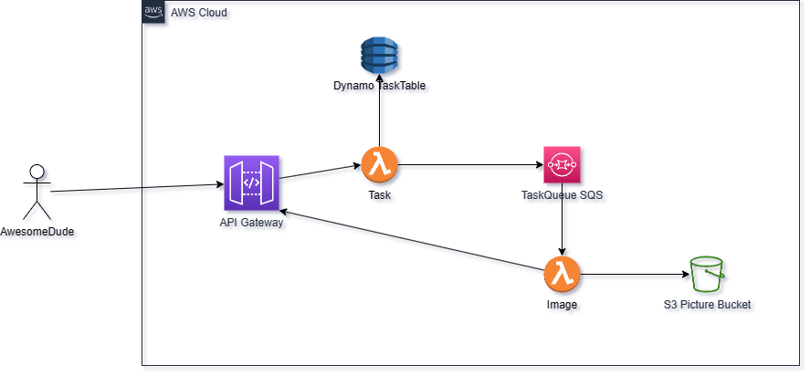

# challenge solution

## Architecture

For this particular project I decided to move on with Serverless framework using AWS Cloud and their services.



So every time you ask a Task, this is submited to an SQS queue, and the task's status being stored (and updated) on a dynamodb table, then another lambda function is subscribed to this queue (image lambda) and when some task need to be done does the cropping and uploading to s3 (because lambdas are ZIP mounted by default doesnt have persistant store, and this was the fastest way to do it without docker images or mounting and s3 drive on it).

Finally when you ask for task status, if the status is DONE, then you will have the "path" inside the s3 to look after the cropped images.

For my own sanity I just included one picture in the zipped lambdas "pic1.jpg" but it work with other files if you add more.

## Make it work
Download repo, have AWS configured and go ahead with:
```
npm i
npm run build
npx sls deploy
```
You probably may want to change the S3 bucket name in your serverless.yml file.

## There is Room for improvement
I've tryied to finish it ASAP. So a lot of stuff that I would love to make, wasn't made at all, so, in order to you see that I'm half way madness I'm leving here a key list of awesome "i-had-no-time-neither-will-if-nobody-pay-me" things to do:

1. <b>Terraform</b>, maybe a little bit more complex -or not- but it pays a lot in some ways (like being able to destroy all easyly or keep it a bit cloud agnostic)

2. I've used hexagonal architecture inside of each microservice kind-of lambda with Functional Programming style, but <b>is not very Single responsability (From SOLID)</b>, so instead of image calling the Task through http rest API, and asking for an update with an API KEY, I would love to delegate the responsability to "change" task ONLY to task, and move comunication to between lambdas stuff, it is something you can do with invoke permisions and the AWS SDK for Nodejs. (and other languages as well I think so).
Anyway I've tried to keep all SIMPLE (KISS).

3. <b>Ability to upload your file</b>, yeah that would be great but having the API Gateway is a mess with multipart upload, the best solution is to use pre-signed s3 url with a short window of time to make the proper upload and then having another way to notice the upload (like a subcription to s3 putobject events or similar) but again this will lead me to a lot of more time.

4. <b>Inddividual packaging</b>: with a bit of love you can have either layers or best packaged lambdas reducing the weight of 15MB to a more cloud-ready thing. Also no dev dependecies are being excluded in deployment.. so that another improvement.

5. <b>Testing</b>: yeah well, you got it, it need to have some jest test (shades architecture helps with inbound and outbound adapters and remaining the business in the core application so you cant test it -kind of domain driven desing DDD).

6. <b>STAGES</b>: like a lot of them, I didnt set anyone so maybe dev - stg - prod should be a really nice first approach.

7. <b>Parameter Store</b>: It would be nice if it use some parameter store AWS SSM to store sensible data.

8. <b>A lot of cool stuff</b>: Yeah I know, its kind of general way to say it but I think like using ports to define adapters interafce in some ways (even when Functional Programming use their own functions parameters as interface), a config directory for each lambda, decide if you want to split use cases across multiple lambdas or use lambda as a kind-of-microservice (it also works), and a lot of things that probably im missing but hey!, you got your challenge done, and you can test it on your own cloud by changing the S3 bucket name and run a simple: `sls deploy`. 

9. I'm wondering, do you really need me to set up all this stuff to know the awesome guy I am?, we could just have a chat, you know drink some beers and save some time but dont missunderstand me, not judging, just saying.
